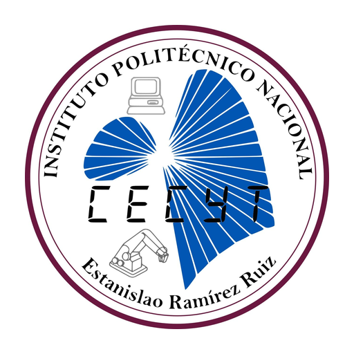
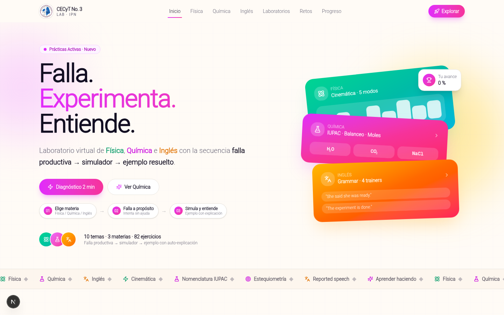
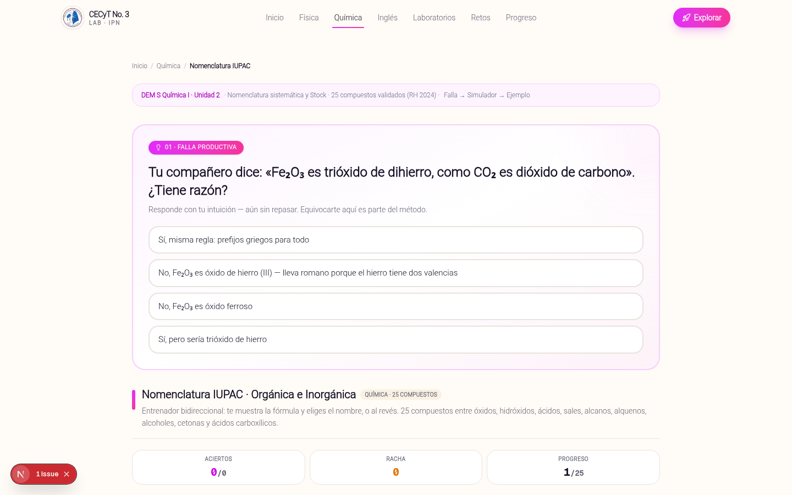
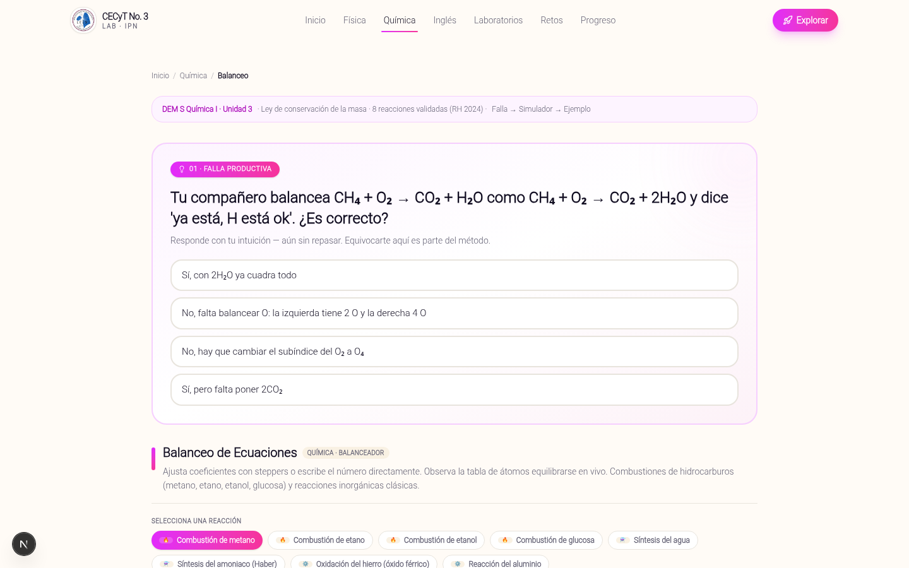
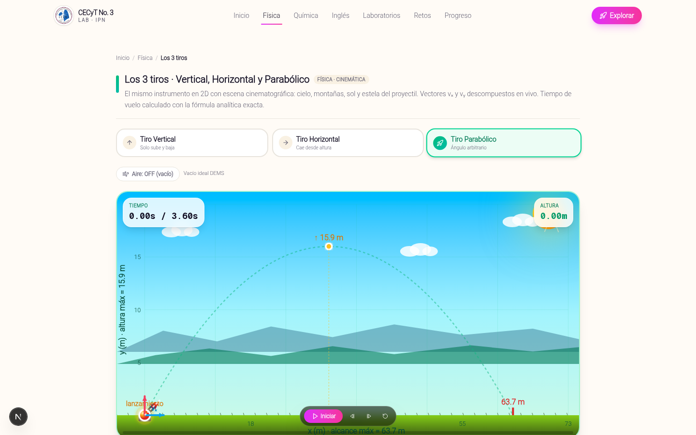
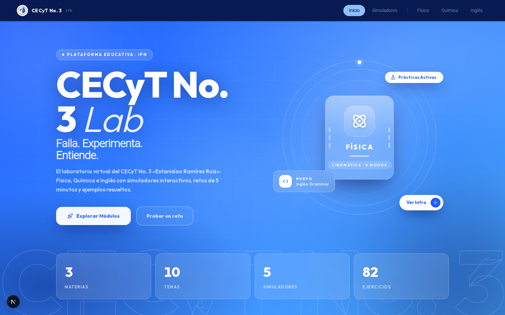

<div align="center">
  
  <h1>CECyT 3 Lab</h1>
  <p><b>Laboratorio virtual de Física · Química · Inglés</b><br/>CECyT No. 3 “Estanislao Ramírez Ruiz” — IPN</p>
  <p><i>Falla. Experimenta. Entiende.</i></p>

  <p>
    <a href="https://cecyt3-lab.vercel.app"><b>→ Ver demo en vivo</b></a>
  </p>

  <p>
    
    
    
    
    
  </p>
</div>

---

### Qué es

Plataforma web para practicar los temas que más reprueban en tronco común. Cada tema sigue la misma secuencia didáctica:

**1. Falla productiva → 2. Simulador → 3. Ejemplo resuelto con auto-explicación**

Basado en Kapur (falla productiva) y Renkl (worked examples). Sin cuentas para probar, con progreso local + nube opcional.

### Demo

<div align="center">
  
  <p><sub>Landing — Falla. Experimenta. Entiende.</sub></p>
</div>

<table>
<tr>
<td width="50%" align="center">
  <br/>
  <sub><b>Química · IUPAC</b> — 25 compuestos + visor 3D</sub>
</td>
<td width="50%" align="center">
  <br/>
  <sub><b>Química · Balanceo</b> — conteo vivo + solver</sub>
</td>
</tr>
<tr>
<td width="50%" align="center">
  <br/>
  <sub><b>Física · Tiros</b> — Euler-Cromer + aire</sub>
</td>
<td width="50%" align="center">
  <br/>
  <sub><b>v1 Azul</b> — ver tag <code>v1-azul</code></sub>
</td>
</tr>
</table>

### Contenido

- **Física 01-03:** MRU, MRUV, 3 tiros. Integración `FIXED_DT 1/120` + acumulador, gráficas x-t / v-t en vivo, toggle aire `F=-k·v·|v|`.
- **Química 04-06:** IUPAC 25 (Stock + prefijos), Balanceo 8 + solver dinámico por matriz nula, Estequiometría con masas molares reales y reactivo limitante.
- **Inglés 07-10:** Verb Tenses, Passive, Modals, Reported. Opción múltiple + escritura libre tolerante (`I'm` = `I am`, sin punto, typo ≤1).
- **Retos + Progreso:** quiz 6 preguntas con explicación en 3 pasos, niveles Novato→Experto, `localStorage` + API `/api/progress` con fallback.

### Stack

`Next.js 16 (App Router) · React 19 · Tailwind 4 · shadcn · Framer Motion · Prisma + Postgres (Supabase) · 3Dmol · Vitest · Playwright`

### Diseño

Sistema en `DESIGN.md` — 1 gradiente primario `fuchsia-500 → pink-500` solo para CTA principal.

- **Física:** `emerald-50 / emerald-700 / emerald-200`
- **Química:** `fuchsia-50 / fuchsia-700 / fuchsia-200`
- **Inglés:** `amber-50 / amber-700 / amber-200`
- Radius cards `16px`, pills `full`, touch `44px`, WCAG AA, `Geist Sans + Mono`.

No más de 2 gradientes por viewport. Todo canvas tiene `aria-live` + `role=img`.

### Estructura

```
src/app/              → / /fisica/* /quimica/* /ingles/* /retos /progreso /api/progress
src/components/simulators/ → mru, mruv, tiros, iupac, balanceo, estequiometría, trainers
src/components/didactic/   → productive-failure.tsx, worked-example.tsx
src/components/chemistry/  → mol-viewer.tsx (3Dmol)
src/lib/              → nlp.ts, balance.ts, utils.ts (+ .test.ts)
prisma/schema.prisma  → User(role) + Progress(userId_topicId) + Event
docs/                 → Charter, WBS, Roadmap, guía-profesor, informe-piloto
```

### Corre local

```bash
npm i
npm run dev     # http://localhost:3000
npm test        # vitest 38 tests
npm run lint
npm run build
```

Backend opcional: copia `.env.example` a `.env` con tu `DATABASE_URL` de Supabase y corre `npx prisma db push`. Sin DB la app sigue funcionando en local.

### Docs

- `PROJECT_CHARTER.md` — objetivos SMART, alcance, riesgos
- `docs/ROADMAP.md` + `docs/WBS.md` — sprints y EDT
- `DESIGN.md` — tokens y reglas
- `docs/guia-profesor.md` + `docs/consentimiento.md` — piloto
- `docs/informe-piloto.md` + `scripts/analisis-piloto.py` — t-test + Cohen d

---

<details>
<summary>Historial de versiones (fotos viejas)</summary>

- `v1-azul` — landing azul original
- `v2-linear` — rediseño Linear-dark
- `v3-actual` — actual Fase 2

```bash
git checkout v1-azul
git checkout v2-linear
git checkout v3-actual
```

Fotos completas en `docs/screenshots/`.

</details>

<p align="center"><sub>Hecho por <b>Alan Villar</b> · CECyT 3 · IPN · MIT</sub></p>
